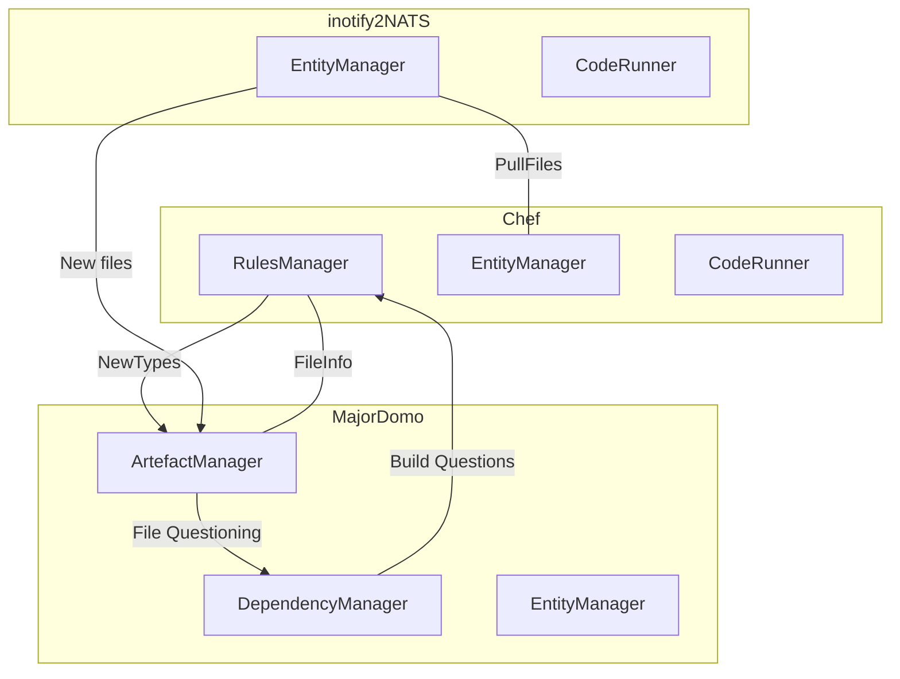

# Task 000 Build a ConTeXt document

## Goal

Our primary objective is to simply build one or more ConTeXt documents
inside a ComputePods system.

## Problems

To do this we will need to run the ConTeXt command line command inside a
worker container.

This requires a Chef to be able to:

- load its build rules using a ruleManager.

- register its artefact types with the MajorDomo artefactManager.

- respond to howToBuild messages from the MajorDomo dependencyManager.

- respond to build messages from the MajorDomo dependencyManager.

- pull files into the container using the entityManager.

- run a command using the codeRunner.

This also requires a system MajorDomo to be able to:

- respond to  artefactType messages.

- respond to file change messages by updating the artefactManager.

    To do this the artefactManager must:

    - recognise files associated with one or more artefact types

    - issue artefactChanged messages

- respond to build messages by updating the dependencyManager.

    To do this the dependencyManager must:

    - issue howToBuild messages and respond to the replies.

    - issue build messages

- respond to artefactChanged messages by updating the dependencyManager.

This also requires a user's inotify2NATs client to:

- send file change messages

- compute sha256 check sums of changed files using a codeRunner.

## Solution

